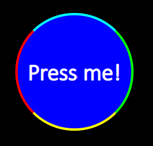
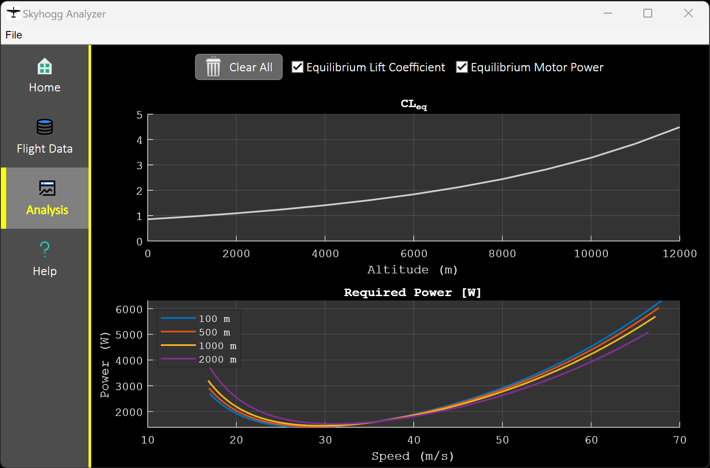

# Customizable HTML Button

Version: 1.0

This custom UI component creates a button that is customizable in several additional ways with respect to the built-in ``uibutton`` component in MATLAB&reg;. Additional customizations can be addeed with JavaScript&reg; and CSS. This custom component can be included inside graphical user interfaces and be made available inside App Designer.

## Example
Customizable HTML buttons can be used on their own inside an app, or they can be used to create new composite components, such as a tab group, as shown below:

## How To Use It
An overview of the component and instructions (with examples) on how to use it are found in ``Example.mlx``.

